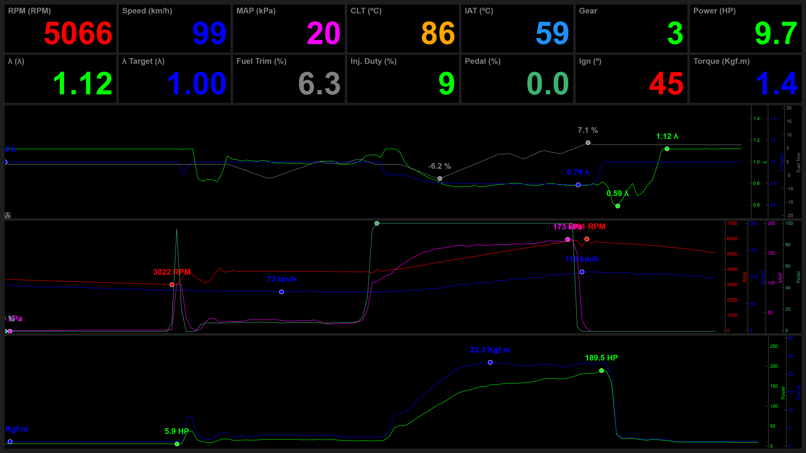

# Master Injection Dashboard

A real-time telemetry dashboard for the Master Injection ECU. Streams sensor data over Bluetooth (Windows COM port), displays live values and graphs, plays audible alarms on limit violations, and logs everything to CSV.



## Demo


---

## Features

- **Full-screen live display** — large high-contrast numeric values with automatic color coding (green = in range, red = out of limits)
- **Real-time graphs** — multi-axis buffered plots with peak/min markers, updated every 100 ms
- **Audible alarms** — plays a `.wav` file while any signal stays outside its configured limits; 2-second cooldown prevents spam
- **Manual event marking** — press **Enter** during a session to beep and stamp `MARK` on the next CSV row, useful for flagging moments of interest during a run
- **CSV logging** — appends every ECU frame with a millisecond Unix timestamp and an optional event label
- **Automatic reconnection** — detects dropped Bluetooth connections and reconnects without restarting the app
- **Mock mode** — replay a previously recorded CSV file instead of connecting to hardware

---

## Requirements

- Windows (COM port + `.wav` playback)
- Python 3.9+
- Bluetooth-paired ECU device

---

## Installation

```bash
pip install -r requirements.txt
```

Dependencies: `pyserial`, `pyqt6`, `pyqtgraph`.

---

## Running

```bash
python main.py
```

Press **Esc** or close the window to exit.

---

## Configuration

All settings are at the top of `main.py`:

| Variable       | Description                                                                           |
|----------------|---------------------------------------------------------------------------------------|
| `PORT`         | Windows COM port (`"COM5"`, etc.)                                                     |
| `BAUDRATE`     | Serial baud rate (default `115200`)                                                   |
| `LOG_FILE`     | Output CSV file path                                                                  |
| `ALARM_SOUND`  | `.wav` file played during limit alarms                                                |
| `EVENT_SOUND`  | `.wav` file played when Enter is pressed                                              |
| `MOCK_FILE`    | Path to a recorded CSV for playback without hardware; set to `""` to use real serial |

Signal definitions (name, ECU index, unit, limits, graph color, alarm thresholds) are hardcoded in `app/master/signal.py`. Dashboard layout is in `app/dashboard/grid.py`.

---

## CSV Format

Each row corresponds to one ECU frame:

```
Timestamp;Event;Mess 1;RPM;MAP;...
1709041234567;;#D01;5000;120;...
1709041234667;MARK;#D01;5100;121;...
```

| Column            | Content                                                        |
|-------------------|----------------------------------------------------------------|
| `Timestamp`       | Unix time in milliseconds                                      |
| `Event`           | `MARK` when Enter was pressed before this row; otherwise empty |
| Remaining columns | Raw ECU fields from the `#D01` and `#D02` frames              |

---

## ECU Protocol

The ECU streams two frame types per cycle over serial:

- `#D01;val1;val2;...` — primary sensor data  
- `#D02;val1;val2;...` — secondary sensor data

The app waits for one of each, joins them with `;`, and processes the combined frame as a single row. Only `#D01`-prefixed frames are logged to CSV.

---

## ECU Data Fields

The combined `#D01;...;#D02;...` frame contains 34 fields (index 0–33). Fields marked **dashboard** are actively displayed and graphed; others are logged to CSV only.

| Index | CSV column        | Sample  | Displayed value       | Notes                                           |
|-------|-------------------|---------|-----------------------|-------------------------------------------------|
| 0     | Mess 1            | `#D01`  | —                     | Frame type marker                               |
| 1     | RPM               | `1055`  | **1055 RPM**          | Direct value                                    |
| 2     | MAP               | `44`    | **44 kPa**            | Manifold absolute pressure                      |
| 3     | Boost             | `104`   | **104 kPa**           | Post-turbo MAP                                  |
| 4     | Load %            | `33`    | —                     | Engine load                                     |
| 5     | Idle              | `33`    | —                     | Idle correction                                 |
| 6     | Lambda 1          | `903`   | **0.90 λ**            | ÷ 1000                                          |
| 7     | Inj. Pulse        | `176`   | —                     | Injection pulse width (raw)                     |
| 8     | Inj. Utiliz.      | `3`     | **3 %**               | Injector duty cycle                             |
| 9     | VE Value          | `627`   | **62.7 %**            | ÷ 10                                            |
| 10    | Ign. Adv.         | `14`    | **14 °**              | Ignition advance                                |
| 11    | Knock             | `0`     | —                     | Knock count                                     |
| 12    | A/C Input         | `0001`  | —                     | Binary digital inputs (4 bits)                  |
| 13    | Start Input       | `1000`  | —                     | Binary digital inputs (4 bits)                  |
| 14    | Outputs 1         | `1101`  | —                     | Binary digital outputs (4 bits)                 |
| 15    | Outputs 2         | `00`    | —                     | Binary digital outputs (2 bits)                 |
| 16    | Lambda 2          | `0`     | —                     | Secondary lambda (0 = not connected)            |
| 17    | Mess 2            | `#D02`  | —                     | Frame type marker                               |
| 18    | Batt Volt.        | `138`   | —                     | ÷ 10 → V (13.8 V)                               |
| 19    | CLT               | `342`   | **69 °C**             | K − 273 (coolant temperature)                   |
| 20    | IAT               | `296`   | **23 °C**             | K − 273 (intake air temperature)                |
| 21    | Inj. DT           | `580`   | —                     | Injector dead time (raw)                        |
| 22    | Ign. Dwell        | `357`   | —                     | Ignition dwell time (raw)                       |
| 23    | KM/H              | `4`     | **4 km/h**            | Vehicle speed                                   |
| 24    | Lambda Loop       | `0`     | **Open**              | 0 = Open loop, 1 = Closed loop                  |
| 25    | Lambda Target     | `1000`  | **1.00 λ**            | ÷ 1000                                          |
| 26    | Lambda Corr       | `1001`  | **−0.1 %**            | (1000 − x) ÷ 10 (fuel trim correction)          |
| 27    | Strobo Angle      | `1170`  | —                     | Strobe timing angle (raw)                       |
| 28    | Turbo Target      | `150`   | **150 kPa**           | Boost target                                    |
| 29    | ACC %             | `0`     | **0.0 %**             | Throttle pedal position; (x ÷ 990) × 100, max 100 |
| 30    | ACP %             | `1013`  | —                     | Throttle position controller output (raw)       |
| 31    | dACC %            | `5000`  | —                     | Delta accelerator (raw)                         |
| 32    | *(reserved)*      | `0`     | —                     |                                                 |
| 33    | *(Gear)*          | `1`     | **1**                 | Current gear (header label `0` is a firmware artifact) |

Two signals are **calculated** by the app and not present in the raw stream:

| Signal  | Formula                                                  | Unit   |
|---------|----------------------------------------------------------|--------|
| Power   | Derived from MAP, VE, RPM, IAT, λ via air-mass equation  | HP     |
| Torque  | Power × 716.2 ÷ RPM                                      | kgf·m  |
